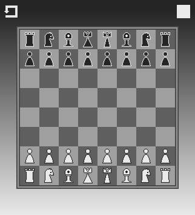
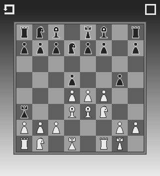
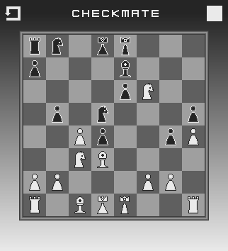

------

FXChess is a basic chess game I created as a learning project.

It has all the major rules of chess aside from some endgame aspects, along with a Reset Button/Turn Indicator.

To run it, enter the project directory and run the Maven command:

`mvn clean javafx:run`
